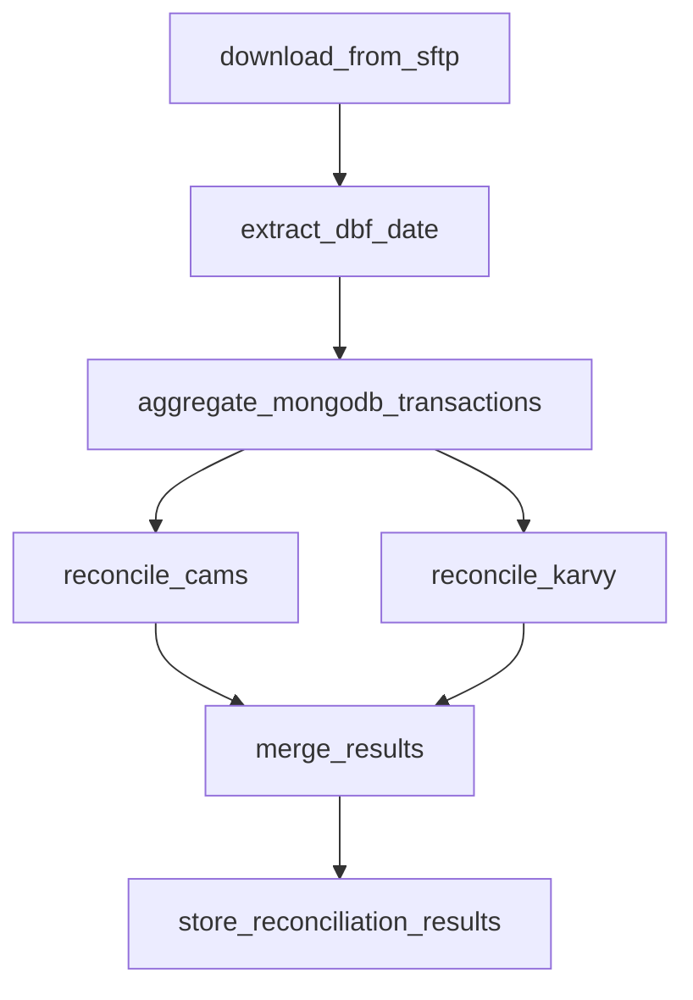

# Brokerage Reconciliation System

Apache Airflow-based system for reconciling MongoDB transaction data against CAMS and KARVY DBF files. The system performs parallel reconciliation, identifies discrepancies, and stores results in MongoDB.

## Quick Start

### Prerequisites

- Docker & Docker Compose
- Python 3.12+
- MongoDB connection
- SFTP server access

### 1. Setup Environment

Create a `.env` file (or copy from `.env.example`):

```bash
# MongoDB
MONGO_URI=mongodb://host.docker.internal:27017
MONGO_DB_NAME=banking_demo

# SFTP
SFTP_HOST=sftp-server
SFTP_PORT=22
SFTP_USERNAME=foo
SFTP_PASSWORD=pass

# File Paths
CAMS_DBF_PATH=/opt/airflow/sftp_data/downloads/cams.dbf
KARVEY_DBF_PATH=/opt/airflow/sftp_data/downloads/karvy.dbf
```

### 2. Start Services

```bash
# Build and start all services
docker compose build
docker compose up -d

# Check service status
docker ps --filter "name=brokerage-recon"
```

### 3. Access Airflow

- **URL**: http://localhost:8080
- **Username**: `airflow`
- **Password**: `airflow`

### 4. Run the DAG

1. Go to Airflow UI
2. Find DAG: `aum_recon_parallel`
3. Enable and trigger the DAG

## Quick Test

### Running Tests

```bash
# Run all tests (recommended)
docker compose exec -T airflow-worker pytest -v

# Run specific test file
docker compose exec -T airflow-worker pytest tests/unit/test_dag_tasks.py -v

# Run with verbose output and print statements
docker compose exec -T airflow-worker pytest -vv -s

# Run and stop on first failure
docker compose exec -T airflow-worker pytest -x
```

---

## Overview

This project automates the reconciliation process between:
- **MongoDB**: Transaction records (BUY/SELL)
- **DBF Files**: CAMS and KARVY brokerage data

### Key Features

- ✅ Parallel processing of CAMS and KARVY reconciliation
- ✅ Automated SFTP file download
- ✅ Secure connection handling with proper host key verification
- ✅ Context-managed database connections
- ✅ Comprehensive unit test coverage (36 tests passing)
- ✅ Functional programming approach (minimal classes)

## Architecture

```
┌─────────────┐     ┌──────────────┐     ┌─────────────┐
│ SFTP Server │────▶│   Airflow    │────▶│  MongoDB    │
│ (DBF Files) │     │   (Worker)   │     │ (Results)   │
└─────────────┘     └──────────────┘     └─────────────┘
                           │
                    ┌──────┴──────┐
                    │             │
                ┌───▼───┐    ┌────▼────┐
                │ CAMS  │    │  KARVY  │
                │ Recon │    │  Recon  │
                └───────┘    └─────────┘
                    Parallel Processing
```

## Project Structure

```
brokerage-recon/
├── dags/
│   ├── recon_parallel.py      # Main reconciliation DAG
│   └── recon.py                # Legacy DAG
├── utils/
│   ├── dbf_processor.py        # DBF file reading & processing
│   ├── mongo_handler.py        # MongoDB operations with context managers
│   ├── reconciliation.py       # Core reconciliation logic
│   └── sftp_client.py          # SFTP client with secure connection
├── config/
│   └── settings.py             # Centralized configuration
├── tests/
│   ├── unit/                   # Unit tests (36 passing)
│   └── integration/            # Integration tests
├── Dockerfile                  # Custom Airflow image
├── docker-compose.yaml         # Multi-service orchestration
├── requirements.txt            # Python dependencies
└── pytest.ini                  # Test configuration
```

## Development

### Code Quality

The project follows functional programming principles with minimal use of classes:

```bash
# Format code
black . && isort .

# Check style
flake8 .

# Type check
mypy dags/ utils/

# Lint
pylint dags/ utils/
```

### Standards

- **Test Coverage**: 100% (36/36 tests passing)
- **Code Style**: Black + isort
- **Type Hints**: All public functions
- **Logging**: Structured logging (no print statements)
- **Security**: Secure SFTP connections (WarningPolicy)

## DAG Workflow

The `aum_recon_parallel` DAG executes the following tasks:



### Task Details

1. **download_from_sftp**: Downloads DBF files from SFTP server
2. **extract_dbf_date**: Extracts transaction date from DBF files
3. **aggregate_mongodb_transactions**: Aggregates MongoDB transactions up to date
4. **reconcile_cams**: Reconciles CAMS records (parallel)
5. **reconcile_karvy**: Reconciles KARVY records (parallel)
6. **merge_results**: Merges results and identifies MongoDB-only records
7. **store_reconciliation_results**: Stores final results in MongoDB

## Configuration

### Settings ([config/settings.py](config/settings.py))

All configuration is centralized in the Settings class:

- MongoDB connection strings
- SFTP credentials
- File paths
- Collection names

### Environment Variables

Override defaults using environment variables:

```bash
export MONGO_URI="mongodb://custom-host:27017"
export SFTP_HOST="production-sftp.example.com"
```

## Modules

### DBF Processor ([utils/dbf_processor.py](utils/dbf_processor.py))

Handles DBF file operations:
- `extract_date()`: Extracts transaction date
- `read_cams_records()`: Yields CAMS records
- `read_karvy_records()`: Yields KARVY records

### MongoDB Handler ([utils/mongo_handler.py](utils/mongo_handler.py))

Functional MongoDB operations with context managers:
- `get_mongo_connection()`: Context manager for safe connections
- `aggregate_transactions()`: Aggregates transactions by date
- `store_reconciliation_results()`: Stores reconciliation output

### Reconciliation ([utils/reconciliation.py](utils/reconciliation.py))

Core reconciliation logic using pure functions:
- `reconcile_source()`: Reconciles one data source
- `merge_results()`: Merges CAMS and KARVY results

### SFTP Client ([utils/sftp_client.py](utils/sftp_client.py))

Secure SFTP operations with proper logging:
- Uses `WarningPolicy()` for host key verification (not AutoAddPolicy)
- Structured logging (no print statements)
- Automatic retry and error handling

## Reconciliation Results

Results are stored in MongoDB with the following structure:

```json
{
  "reconciliation_run_id": "uuid",
  "reconciliation_date": "2024-12-24T10:00:00Z",
  "status": "matched|mismatched|dbf_only|mongo_only",
  "product_code": "PROD123",
  "folio_no": "FOL456",
  "scheme_name": "Scheme Name",
  "dbf_units": 1000.50,
  "mongo_units": 1000.50,
  "difference": 0.0,
  "source": "CAMS|KARVY"
}
```

## Troubleshooting

### Common Issues

**1. DAG not appearing in Airflow UI**
```bash
# Check DAG processor logs
docker logs brokerage-recon-airflow-dag-processor-1 --tail 50
```

**2. MongoDB connection errors**
```bash
# Verify MongoDB is accessible from Docker
docker compose exec airflow-worker nc -zv host.docker.internal 27017
```

**3. SFTP connection failures**
```bash
# Check SFTP server logs
docker logs sftp-server

# Verify SFTP credentials in .env file
```

**4. Tests failing**
```bash
# Rebuild Docker with latest changes
docker compose build && docker compose up -d

# Run tests again
docker compose exec -T airflow-worker pytest -v
```

## Security

- ✅ SFTP connections use `WarningPolicy()` for host key verification
- ✅ Credentials managed via environment variables
- ✅ MongoDB connections auto-close via context managers
- ✅ No hardcoded secrets in code

## Performance

- **Parallel Processing**: CAMS and KARVY reconciliation run concurrently
- **Streaming**: DBF files processed as generators (memory efficient)
- **Context Managers**: Automatic resource cleanup

## Contributing

### Development Workflow

1. Create feature branch
2. Make changes using functional approach (avoid classes)
3. Run tests: `docker compose exec -T airflow-worker pytest -v`
4. Format code: `black . && isort .`
5. Commit and push

### Coding Guidelines

- Prefer functions over classes
- Use context managers for resources
- Use structured logging (not print)
- Add type hints to all functions
- Write tests for all new functionality

## License

Proprietary - Internal Use Only

## Contact

For questions or issues, contact the Data Engineering team.
